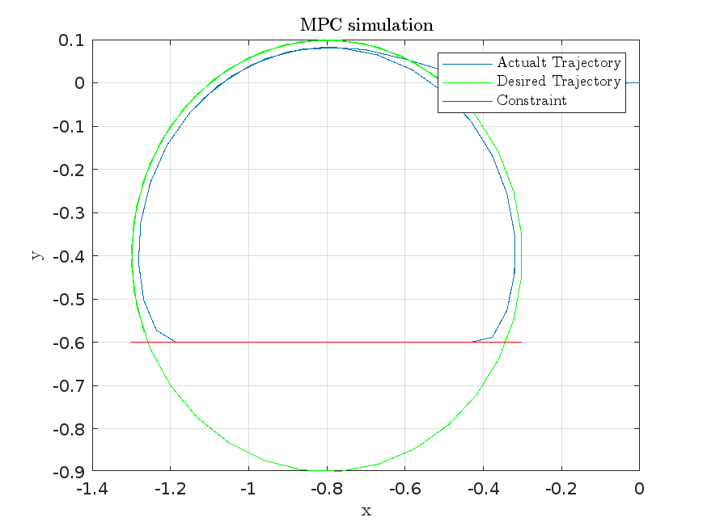

For some context/details about the assignment, see the [instructions PDF](<Assignment - MPCEandTurtleBot3.pdf>).

## Instructions

First, install CVX if you haven't already. Download CVX from [here](https://github.com/cvxr/cvx/releases/latest). Extract `cvx.zip` to a directory of your choice. Then, from the Matlab console, `cd` to that directory and run `cvx_setup`. For example:
```shell
cd ./cvx
cvx_setup
```

You can then run the MPC simulation by running `MPCsimPredictionModelStudent.m`. This will output the following Figures:

| Figure 1 | Figure 2 |
| --- | --- |
|  |  |